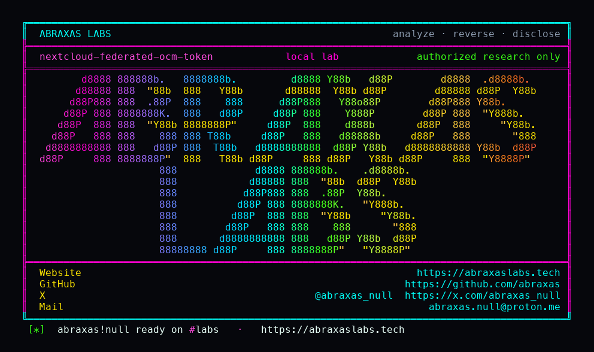

<p align="center">
  
</p>

<p align="center">
  <a href="https://abraxaslabs.tech"><strong>abraxaslabs.tech</strong></a>
  &nbsp;·&nbsp;
  <a href="https://github.com/abraxas">github.com/abraxas</a>
  &nbsp;·&nbsp;
  <a href="https://x.com/abraxas_null">@abraxas_null</a>
  &nbsp;·&nbsp;
  <a href="https://github.com/abraxas/nextcloud-federated-ocm-token">nextcloud-federated-ocm-token</a>
</p>

# nextcloud-federated-ocm-token

**Nextcloud Server** `35.0.0` - Nextcloud GmbH

A federated share secret is minted as an unscoped `PERMANENT_TOKEN` app password for the sharer. The recipient API returns it as `refresh_token`. Replaying it as Bearer on the sender WebDAV logs in as the sharer and reads files **that were never shared**.

**A bad actor you federated-share one file with can log in as you on your Nextcloud, skip 2FA, and read or overwrite all of your files, not just the one you shared.**

| | |
|---|---|
| ID | no CVE yet |
| CWE | [CWE-269, CWE-287](https://cwe.mitre.org/data/definitions/269.html) |
| CVSS | **Critical: 8.1** `CVSS:3.1/AV:N/AC:L/PR:L/UI:N/S:U/C:H/I:H/A:N` (federated recipient). Public-link convert is worse (no recipient account on a peer). |
| Product | [Nextcloud Server](https://github.com/nextcloud/server) |
| Affected | **35.0.0** (`da02f41`) official `nextcloud:35.0.0-apache` |
| Auth | federated recipient (or public-link converter) |
| License | [GNU Affero GPL v3.0](LICENSE) |
| Lab | `127.0.0.1` only |

---

## What an attacker can do

You share **one** file or folder with `bob` on another Nextcloud. Nextcloud mints a 32-character secret, stores it as **your app password**, and hands that secret to Bob as `refresh_token`.

Bob (or anyone who converts your **public link** into a federated share) then:

- **Logs in as you** on **your** server
- **Reads every file** in your home, not only the shared node
- **Overwrites** those files
- **Skips your 2FA** (app-password path)

They do not get a PHP shell on the host. They do not need your password. Do not accept the share and do not call OCM `access-token` first: that exchange locks filesystem scope. The lab proves the **pre-exchange** secret.

---

## How I found it

A share is supposed to be a share. One file. One folder. I read `FederatedShareProvider::createFederatedShare` on tag v35.0.0. It mints a 32-character secret as `IToken::PERMANENT_TOKEN` for the sharer with no scope. `PublicKeyToken::getScopeAsArray` defaults `SCOPE_FILESYSTEM => true`. That is an app password. `Session::tryTokenLogin` takes a permanent Bearer.

The OCM exchange work (PR #57234 / #57166) already locks filesystem scope **after** the first exchange. An unofficial writeup used that post-exchange hop. I tried it first. On this tree the exchanged token is `TEMPORARY`, named `OCM Access Token`, and `/remote.php/dav` rejects it (`allowOcmAccessToken` false). DAV said no.

So I did not exchange. `ocm_discovery_enabled` stayed false so the recipient would not exchange it for me. Two official `nextcloud:35.0.0-apache` boxes, `overwrite.cli.url` as docker DNS (`http://sender` / `http://recipient`). Leave that at `127.0.0.1` and S2S talks to itself.

Alice shares one file with `bob@http://recipient`. Bob reads pending shares. `refresh_token` length 32. `access_token` length 0. Unauthenticated Bearer GET of Alice's private witness file, never in the share, returned **200**, `X-User-Id: alice`.

---

## Lab

```bash
cd lab
./run.sh
```

Target **only** `http://127.0.0.1:18340` (sender) and `:18341` (recipient).

```text
SUCCESS NEXTCLOUD-OCM-PERMANENT-TOKEN who=federated-recipient uid=alice NEXTCLOUD-OCM-PERMANENT-TOKEN-WITNESS
```

- [`lab/docker-compose.yml`](lab/docker-compose.yml)
- [`lab/Dockerfile`](lab/Dockerfile)
- [`lab/run.sh`](lab/run.sh)

---

## The fix

Mint the federated secret with filesystem scope false from the first insert. Do not accept that secret as Bearer/Basic on `/remote.php/dav`. First exchange already locks FS scope; create should never have handed out an app password.

---

## References

- [github.com/nextcloud/server](https://github.com/nextcloud/server) tag [v35.0.0](https://github.com/nextcloud/server/releases/tag/v35.0.0)
- Nearby OCM work: [PR #57234](https://github.com/nextcloud/server/pull/57234) / [PR #57166](https://github.com/nextcloud/server/pull/57166)
- Abraxas Labs: [abraxaslabs.tech](https://abraxaslabs.tech) · [github.com/abraxas](https://github.com/abraxas) · [@abraxas_null](https://x.com/abraxas_null)

---

## License

GNU Affero GPL v3.0. See [LICENSE](LICENSE). Loopback lab only. No warranty.
